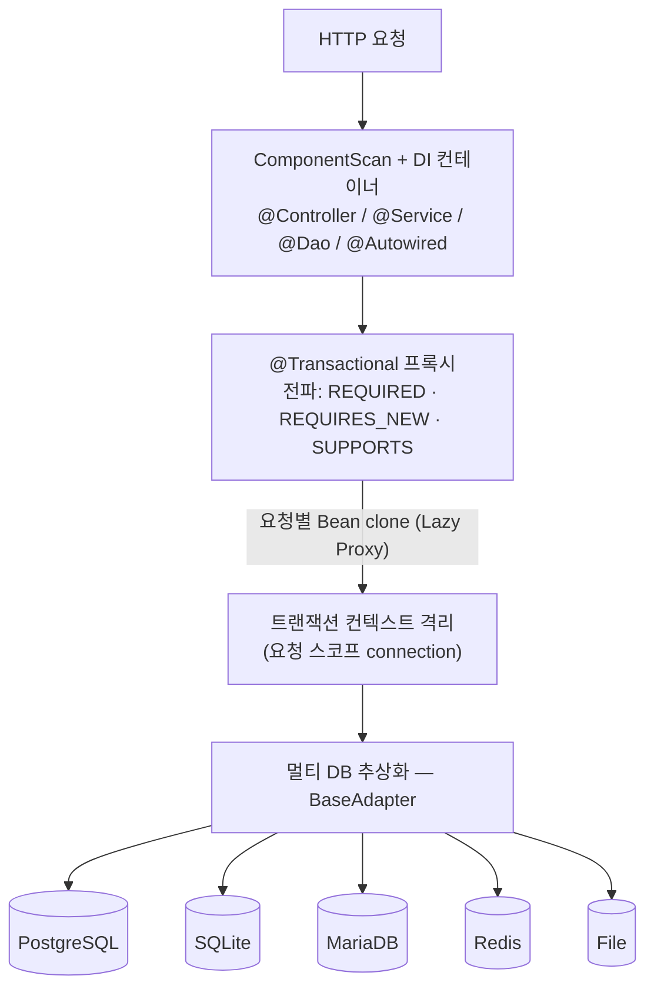
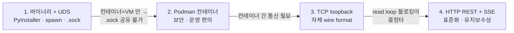
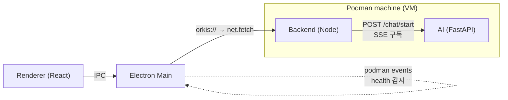
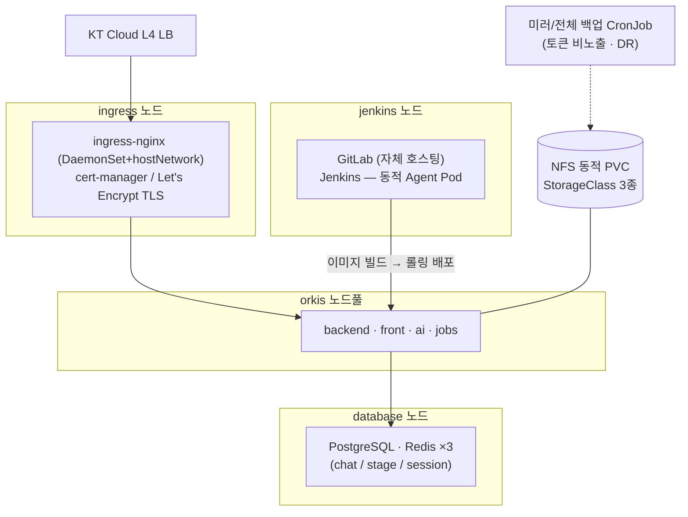

# Portfolio — 전준영 @ (주)범익 (Orkis 프로젝트)

> 자연어 → SQL 생성 → 사용자 DB 실행을 수행하는 **Text-to-SQL 연구 플랫폼 "Orkis"** 개발기.
> 백엔드/인프라 엔지니어로서 **자체 프레임워크 설계 · 동시성 디버깅 · 단일 코드베이스 멀티 배포 · 통신 인프라 마이그레이션**을 주도했습니다.

---

## 📑 한눈에 보기

| 섹션 | 내용 | 형태 |
|---|---|---|
| 🏆 **대표 성과 3선** | 자체 `@Transactional` · 단일 코드베이스 멀티 배포 · 통신 마이그레이션 | 요약 |
| 🧩 **@orkis/core 아키텍처** | DI · 트랜잭션 전파 · 멀티 DB 추상화 | 그림 |
| 🔄 **데스크탑 통신 진화** | 바이너리+UDS → Podman+TCP → HTTP/SSE 의사결정 | 그림+서술 |
| 🛠️ **인프라 (k8s)** | KT Cloud ManagedKS 7노드 GitOps 단독 구축 | 그림+서술 |
| 🔧 **트러블슈팅** | 33건 — 코어 / 통신 / 프론트 / 데스크탑 / 성능 / 인프라 | 인덱스+상세 |

---

## 🏆 대표 성과 3선

### 1. Node.js에 Spring `@Transactional`을 자체 구현 — 트랜잭션 전파 + Lazy Proxy

선언적 트랜잭션을 데코레이터 메타데이터 + 메서드 래핑으로 구현하고, **REQUIRED / REQUIRES_NEW / SUPPORTS 전파 정책**까지 지원했습니다. 트랜잭션 컨텍스트를 Bean clone과 `new Proxy`로 격리·전파하되, **실제 접근 시점에만 clone을 생성하는 Lazy 전략**으로 오버헤드를 최소화했습니다.

> JavaScript에는 트랜잭션 컨텍스트 전파라는 개념이 없습니다. 이를 프레임워크 수준에서 Proxy/Reflect 메타프로그래밍으로 풀어냈습니다.

`@orkis/core`

### 2. 단일 코드베이스로 Cloud(PG+Redis) · Desktop(SQLite+File) 동시 지원

TypeScript `paths` fallback(`@/* → [desktop, main]`)과 `tsc-alias`를 조합해, **같은 import가 빌드 타깃에 따라 desktop override 우선 / 없으면 main fallback**으로 자동 해석되게 설계했습니다. 클라우드 개발자의 IDE에는 desktop 코드가 보이지 않고, 빌드 산출물·ComponentScan·런타임 resolution까지 모두 검증했습니다.

> "exclude가 transitive import를 막지 못한다"는 비자명한 컴파일러 동작을 진단해 **폴더 단위 cascade exclude**로 해결한, 컴파일러 내부 이해가 필요한 아키텍처 작업입니다.

`orkis-backend`

### 3. 통신 인프라 마이그레이션 — 커스텀 TCP 소켓 → 표준 HTTP/SSE

데스크탑 앱의 Electron(런처)과 Python AI(백엔드) **양 끝단을 짝지어**, 직접 구현했던 length-prefix wire format·shared secret 인증·backpressure dispatch loop를 통째로 제거하고 표준 HTTP REST + SSE로 전환했습니다. 서비스 ready 판정도 socket 연결 → `podman events` HEALTHCHECK 스트림 파싱으로 대체했습니다.

> 설계 → 구현 → 데드코드 제거까지 두 저장소를 동시에 마이그레이션. 유지비 높은 자체 통신 인프라를 표준 기술로 대체하고 클라우드 버전과 컨벤션을 정렬했습니다.

`orkis-desktop` · `orkis-desktop-ai`

---

## 🧩 @orkis/core 아키텍처 — 자체 백엔드 프레임워크

> Spring Boot 스타일의 DI·트랜잭션·DB 추상화를 TypeScript로 직접 설계했습니다. 핵심은 **요청마다 Bean을 Lazy clone해 트랜잭션 컨텍스트를 격리**하고, 그 아래 **5종 DB를 단일 어댑터 인터페이스로 추상화**한 것입니다.

> **설계 의도** ① JS에 없는 *트랜잭션 컨텍스트 전파*를 Proxy/Reflect로 구현 ② 실제 접근 시점에만 clone하는 *Lazy 전략*으로 오버헤드 최소화 ③ DB를 한 인터페이스로 추상화해 **Cloud(PG/Redis) ↔ Desktop(SQLite/File)을 같은 코드로 지원**. 관련 이슈: Case 1·4·12·13·17.

`@orkis/core`

---

## 🔄 아키텍처 진화 — 데스크탑 통신 방식 (바이너리+UDS → Podman+TCP → HTTP/SSE)

> 데스크탑 앱은 **Electron 런처 · Node 백엔드 · Python AI** 세 프로세스가 한 머신 안에서 통신해야 합니다. 이 통신 방식을 네 단계에 걸쳐 바꿨는데, **각 전환마다 "무엇을 얻고 무엇을 버리는가"를 판단한 의사결정 과정**이 핵심입니다.

**현재 구조 (4단계 도착점)**

#### 1단계 — Python 바이너리 + 자식 프로세스 + UDS

Python AI를 **PyInstaller로 단일 바이너리**(`sys.frozen`/`_MEIPASS` 경로 처리)로 패키징하고, 백엔드를 Electron의 **자식 프로세스로 spawn**한 뒤, 세 프로세스를 **Unix Domain Socket(UDS)**으로 연결했습니다.

- **장점** 포트 점유 없이 로컬 프로세스 간 빠른 통신.
- **한계** 바이너리 직접 실행은 OS·아키텍처별 빌드/서명/의존성 관리 부담이 크고, 런타임 격리가 약함.

#### 2단계 — Podman 컨테이너 도입 (보안 · 운영 편의)

바이너리 직접 실행을 **Podman 컨테이너 실행**으로 전환했습니다. 컨테이너 라이프사이클(`container.manager` / `machine.manager` / `image.manager` / `podman.executor`)과 `podman events` 기반 헬스 모니터링을 직접 구현했습니다.

- **전환 이유** 의존성·런타임을 이미지로 봉인해 **운영 편의·보안·재현성**을 확보.
- **부작용** 컨테이너는 Podman machine(Linux VM) 안에서 돌아가므로 **host의 UDS `.sock` 경로를 공유할 수 없음** → UDS를 폐기해야 했습니다.

#### 3단계 — TCP Socket (loopback) + 자체 wire format

UDS를 대체해 컨테이너 간 통신을 **TCP loopback 소켓**으로 구현했습니다. length-prefix wire format(4바이트 길이 헤더), shared secret 인증, backpressure dispatch loop까지 직접 만들었습니다.

- **한계** 단방향 스트리밍(LLM 토큰)인데 **양방향 소켓**을 쓰는 비대칭 구조. 자체 프로토콜이라 디버깅에 tcpdump/Wireshark가 필요하고, 양 끝단(Node/Python) 스택이 어긋남.

#### 4단계 — 표준 HTTP REST + SSE 전환 (read loop 블로킹이 결정타)

결정적 계기는 **Python AI의 소켓 read loop 블로킹**이었습니다. read loop가 `await handler()`로 동기 I/O(파일 저장·DB 조회)를 그대로 실행해 루프 자체가 점유되면서, 동시 채팅 처리량이 떨어졌습니다. (→ Case 20과 동일 뿌리)

이를 계기로 자체 통신 인프라를 통째로 걷어내고 **표준 HTTP REST + SSE**로 전환했습니다.

- **AI** FastAPI `StreamingResponse` + `EventTransport` 추상화로 전송 계층을 교체 가능하게 설계, read loop는 `create_task` + `asyncio.to_thread`로 논블로킹화.
- **백엔드** AI `/chat/start` SSE를 fetch ReadableStream으로 직접 구독하고, **Cloud와 동일한 이벤트 계약**으로 프론트에 forward(대표 성과 3선 #3 참고).
- **결과** `socketClient.ts`/`socketSender.ts`/`EVENT_SOCKET_SECRET` 등 자체 소켓 인프라를 **완전 제거**. 양 끝단을 표준 기술로 정렬하고 Cloud 버전과 컨벤션을 통일.

> **요약** 빠른 IPC(UDS) → 운영/보안(컨테이너) → 컨테이너 제약 회피(TCP) → 유지보수성·표준화(HTTP/SSE). 매 단계 트레이드오프를 명시적으로 판단하며 통신 계층을 진화시킨 과정입니다.

`orkis-desktop` · `orkis-desktop-ai` · `orkis-backend`

---

## 🛠️ 인프라 — 연구소 쿠버네티스 플랫폼 직접 구축 (GitOps)

> KT Cloud ManagedKS 위에 **클러스터·네트워킹·스토리지·CI/CD·데이터 서비스 전체를 매니페스트로 코드화**(IaC). 7노드·28파드 규모를 단독 설계·운영. 온프레미스(E3TS)에서 시작한 인프라 경험을 클라우드 네이티브로 확장했습니다.

- **노드 역할 분리 아키텍처** — `nodeSelector` 라벨(`app=ingress / jenkins / orkis-database / orkis`)로 워크로드별 노드 풀을 격리해 진입점·CI·DB·앱의 자원 간섭을 차단.
- **무중단 진입 계층** — ingress-nginx를 **DaemonSet + hostNetwork**로 전용 노드에서만 80/443 listen, KT Cloud L4 LB 패스스루. cert-manager + Let's Encrypt로 TLS 자동 발급·갱신(staging 선검증 → prod 전환으로 rate limit 회피).
- **SSE를 위한 인그레스 튜닝** — 쿠키 Sticky Session + `proxy-buffering off` + read timeout 1800s로 장시간 LLM 스트리밍 연결 유지. Text-to-SQL의 실시간 응답을 인프라 레벨에서 보장.
- **NFS 동적 프로비저닝** — KT Cloud NAS를 provisioner로 동적 PVC화, StorageClass 3종(운영 Retain / 개발 Delete / 정적 매핑)으로 환경별 데이터 수명 정책 분리.
- **사내 CI/CD 플랫폼 자체 호스팅** — GitLab을 k8s 위에 직접 호스팅(`git.orkis.kr`), Jenkins는 Kubernetes Plugin으로 **빌드마다 Agent Pod를 동적 생성→자동 소멸**. 최소 권한 RBAC(크로스 네임스페이스 RoleBinding)로 배포 권한 격리.

### 인프라 Case A. 토큰을 디스크에 남기지 않는 GitLab 미러 백업 (보안 + DR)

- **과제** 전 사내 소스를 매일 자동 백업하되, NAS에 저장되는 백업물에 인증 토큰이 노출되지 않아야 함.
- **해결** CronJob에서 GitLab API를 페이지네이션으로 순회해 전 프로젝트를 증분 `git fetch`. 인증은 `oauth2:TOKEN`을 **fetch 호출 URL에만** 실어 보내고, 디스크의 origin URL에는 토큰 없는 clean URL을 기록. 일요일엔 tar.gz 스냅샷 생성 후 30일 초과분 자동 삭제.
- **결과** 소스 유실 시 임의 git 호스트로 `git push --mirror` 복원 가능한 DR 체계 + 백업물 토큰 노출 제거. GitLab 자체 장애용 전체 백업(분기 1회, 90일 gzip/365일 삭제)과 **2단 백업 전략**으로 분리.

`k8s-config` · `cicd/gitlab/deployments/`

---

## 🔧 트러블슈팅 — 33건 (이슈 → 원인 → 해결 → 결과)

> 아래는 **영역별 인덱스**입니다. 번호를 따라 해당 상세 케이스로 내려가면 됩니다. *(★ = 근본 원인까지 파고든 대표 사례)*

- **코어 (@orkis/core)** — 1★ SQLite mutex · 2 RETURNING 더블실행 · 4 connection race · 12★ REQUIRES_NEW 격리 회귀 · 13 요청스코프 누수 · 14 부트스트랩 로그 · 15 DB연결 크래시 · 16 라우터 정규화 · 17 MariaDB BigInt
- **백엔드 · RAG** — 3★ placeholder 순서 · 5 LLM id/모델명 · 6★ Redis 없이 SSE 직접구독 · 18 SQLite EXISTS · 23 취소 채팅 이력복원 · 25 전처리 병렬화 · 26 케이스 컨벤션 통일
- **통신** — 19★ UTF-8 손상+버퍼누수 · 20★ read_loop 블로킹 · 21 transport None
- **프론트엔드** — 9 edge-triggered 아이콘 · 10 IME Enter 중복 · 22★ ESM 청크 순환 흰화면
- **데스크탑** — 8 크로스플랫폼 런처 · 24 app:ready 유실
- **인프라 · CI/CD** — A 미러백업 토큰 비노출 · 7 세션 메모리누수 · 11 sqlite3 빌드 · 27 CrashLoop(.gitignore) · 28 Jenkins 빌드 · 29 GitLab 레지스트리 복원 · 30 PG ext4/권한 · 31 imagePull 캐시 · 32 Reclaim 정책

---

### Case 1. SQLite 동시 트랜잭션 충돌 — 자체 비동기 mutex로 직렬화

- **상황** 데스크탑 첫 화면 로드 시 codes/keywords/llm 등 여러 API가 병렬 호출됨.
- **원인** SQLite 어댑터의 `connect()`는 **단일 connection을 공유**(PostgreSQL은 Pool에서 매번 새 client 반환). 동시 요청이 같은 connection에 각각 `BEGIN`을 실행 → `cannot start a transaction within a transaction`, 연쇄적으로 `no transaction is active`까지 발생.
- **해결** 어댑터에 **비동기 mutex(`txMutexHeld` + waiter 큐)**를 직접 구현해 트랜잭션을 직렬화. BEGIN 실패 시 즉시 해제, rollback 실패에도 해제(누락 시 영구 deadlock)하는 엣지 케이스까지 `finally`로 방어.
- **결과** 동시 BEGIN 충돌 제거, 3개 병렬 호출 동시 200 검증. 코드 주석에 "병목 실측 시 PG식 pool 전환"이라는 한계·향후 개선까지 명시.

> 핵심은 **"어댑터마다 connection 수명주기가 다르다"는 근본 원인**까지 파고든 점입니다. `@orkis/core`

### Case 2. SQLite `RETURNING` statement 더블 실행 — 라이브러리 버그 우회

- **상황** `INSERT ... RETURNING` 및 `WITH ... RETURNING`(CTE) 실행 시 UNIQUE constraint 위반이 조용히 재현됨.
- **원인** `sqlite3` npm v5의 `db.all()`이 RETURNING 구문에서 prepare/step 사이클 중 statement를 **두 번 실행**하는 알려진 버그.
- **해결** RETURNING 포함 시 `db.each()`(streaming step)로 우회하는 `executeReturning` 분기 추가. `\bRETURNING\b` **word-boundary 정규식**으로 컬럼명·주석의 'returning' 오탐 방지.
- **결과** 더블 실행/silent 위반 차단. 의존 라이브러리 내부 동작을 이해하고 우회한 사례.

`@orkis/core`

### Case 3. PG ↔ SQLite placeholder 순서 차이로 인한 침묵 버그(빈 화면)

- **상황** 공지 화면이 항상 "준비 중"으로 표시됨.
- **원인** PostgreSQL은 `$1,$2` 명시적 numbering이라 인자 순서가 자유롭지만, SQLite `?`는 **SQL 등장 위치 순서에 의존**. 인자를 `[...values, userId, limit, offset]`로 넘겨 `WHERE is_active = ?`에 `userId`가 바인딩 → 매칭 0건.
- **해결** SQL의 `?` 위치(JOIN → WHERE → LIMIT → OFFSET)에 맞춰 인자 재정렬. 동일 패턴을 전 DAO에 회귀 검증.
- **결과** dialect 차이로 인한 silent failure를 근본 원인까지 추적, 이후 "동일 `$N` 2회 참조 시 인자 2번 push" 규칙으로 교훈을 체계화.

`orkis-backend`

### Case 4. 트랜잭션 내 `Promise.all` 동시성 — connection 중복 생성 Race Condition

- **원인** 트랜잭션 안에서 `Promise.all`로 동시 쿼리 실행 시, 같은 datasource의 connection 획득이 동시에 일어나 connection이 중복 생성됨.
- **해결** 진행 중인 connection 획득 Promise를 `pendingConnections` Map에 저장하고, `connections.set` 직후 `delete`하는 **순서 보장**으로 중복 생성을 방지.
- **결과** 같은 요청 내 동일 datasource는 단일 connection 공유, 동시 첫 쿼리도 안전하게 직렬화.

`@orkis/core`

### Case 5. LLM 모델 ID vs 모델명 mismatch — RAG 연동 실패

- **상황** SQL 질문이 AI 서버에서 pydantic validation 에러로 실패.
- **원인** 백엔드가 DB 레코드 **id**(예: `42`)를 전달했으나 AI는 **모델명 enum**(`gpt-4o`)을 기대.
- **해결** 항상 `LLMModelService.resolveByIdForInternal`을 경유해 `modelName`을 전달. env 폴백을 제거하고 `llm_user_models` 테이블을 **단일 진실 원천**으로 통일.
- **결과** general 질문 + 제목 생성 + SQL 질문(생성→실행→영속화) 전 흐름 성공.

`orkis-backend`

### Case 6. Redis 없이 AI SSE를 직접 구독 — 프론트 코드 무수정 호환

- **상황** Cloud는 `AI → Redis stream → 폴링 → SSE`의 3-hop 구조인데, 데스크탑에는 Redis가 없음.
- **해결** 백엔드가 AI `/chat/start` SSE를 **직접 구독**(fetch ReadableStream + TextDecoder로 `\n\n` 단위 파싱)한 뒤, Cloud와 **동일한 `message_stream {chatId, type, payload}` 계약**으로 변환해 프론트에 forward.
- **결과** 완전히 다른 두 전송 구조를 동일 이벤트 계약으로 추상화해 **프론트 코드를 한 줄도 바꾸지 않고** 통합.

`orkis-backend`

### Case 7. Redis 세션 완료 판정 결함 — 메모리 누수

- **원인** 완료 세션 삭제 시 9개 필수 단계(`0_0`~`2_2`) 전체 존재 여부로 판정 → 단계 하나라도 누락되면 영구 잔류.
- **해결** 종료 단계 `2_2`(job_end) 존재만으로 판정하도록 단순화 + 빈 데이터 가드.
- **결과** 실제 종료 신호 기준으로 정확히 정리, 잔류 세션 제거.

`orkis-jobs`

### Case 8. Windows 크로스플랫폼 컨테이너 런처

- **과제** Podman 컨테이너를 mac과 Windows(WSL2) 모두에서 안정 구동.
- **해결** mac / Windows-NAT / Windows-mirrored 3개 네트워크 모드를 `ContainerNetConfig` 단일 함수로 집중(.wslconfig 정규식으로 mirrored 자동 감지, WSL 어댑터 IP 추출). `net.createServer().listen()`으로 포트 사전 확보, NSIS 설치 스크립트의 프로세스 종료 대기·APPDATA 경로 문제 해결.
- **결과** `machine.manager`를 191→120줄로 축소하며 Windows 전용 workaround 제거.

`orkis-desktop`

### Case 9. Podman events는 edge-triggered — 상태 아이콘 회색 표시 버그

- **원인** `podman events`는 상태 변화 시점에만 emit(edge-triggered)이라, 이미 healthy가 된 후 화면을 새로고침하면 store가 비어 RAG 상태 아이콘이 회색으로 남음.
- **해결** zustand `persist`(localStorage rehydrate)로 마지막 상태를 복원.
- **결과** 이벤트 모델(edge vs level)의 근본 차이를 진단해 해결.

`orkis-front`

### Case 10. Mac 한글(IME) 입력 시 Enter 중복 전송

- **원인** 한글 조합 중 Enter가 조합 확정과 전송 두 번으로 처리됨. 기존엔 `100ms 디바운스 ref`라는 임시방편으로 대응.
- **해결** 표준 가드 `nativeEvent.isComposing || keyCode === 229`로 교체.
- **결과** 임시방편을 정공법으로 대체.

`orkis-front`

### Case 11. Docker에서 sqlite3 네이티브 모듈 빌드 실패

- **원인** Alpine 기반 Node 이미지에 네이티브 빌드 도구 부재.
- **해결** 여러 번의 빌드 도구 추가 시도 후 **Debian(bullseye) 계열 이미지로 전환** + `build-essential` 설치. multi-stage builder에서 컴파일.
- **결과** 약 15개 커밋에 걸친 끈질긴 트러블슈팅으로 빌드 안정화.

`orkis-backend` · `orkis-jobs`

---

## 🔧 트러블슈팅 — 업무일지 기반 추가 (영역별)

### 코어 프레임워크 (@orkis/core)

#### Case 12. 리팩토링이 부른 트랜잭션 격리 회귀 — `REQUIRES_NEW`가 우회됨

- **상황** Bean clone 성능 리팩토링(`CLONE_SPEC`) 직후, `REQUIRES_NEW` 전파 모드가 기존 트랜잭션을 새로 분리하지 않고 그대로 올라타는 회귀 발생. 에러는 없음.
- **원인** `buildCloneSpec`이 `wrapTransactionalMethods`보다 **먼저** 실행되어, clone이 트랜잭션 래핑 전의 원본 메서드를 snapshot → propagation 분기 로직을 통째로 우회.
- **해결** `injectDependencies` 순서를 `wrapTransactionalMethods → buildCloneSpec`으로 재배치하고, `wrapTransactionalMethods(hasConnections)` 파라미터와 `beanClone[CLONE_SPEC]` 주입으로 재진입 안정성 확보.
- **결과** PostgreSQL **`xmin` 기반 검증**으로 두 서비스가 각각 독립 트랜잭션(xmin 1299/1300)임을 확인 — 회귀 당시 단일 공유(1298)와 대비해 격리 복원을 입증.

`@orkis/core`

#### Case 13. 요청 스코프 트랜잭션 — 전역 Map이 만든 충돌·누수

- **원인** connection 획득 Promise를 **모듈 전역** `Map<requestUUID:datasource, Promise>`로 관리 → ① 8자 UUID의 Birthday collision로 다른 요청이 같은 Promise를 공유할 위험, ② `connect()` 실패 시 rejected Promise가 Map에 영구 잔존해 재시도 불가 + 메모리 누수.
- **해결** `pendingConnections`를 전역에서 **요청별 `createTransactionContext` 내부 로컬 변수**로 이동하고, clone/proxy/adapter 시그니처에 인자로 전파. 각 요청이 독립 맵을 소유하고 스코프 종료 시 자동 정리.
- **결과** 트랜잭션 격리를 구조적으로 보장. REQUIRED/REQUIRES_NEW/SUPPORTS 5개 시나리오를 SQLite placeholder 계약으로 검증하는 테스트 인프라까지 구축.

`@orkis/core`

#### Case 14. 환경변수 로드 타이밍에 죽는 부트스트랩 로그

- **원인** `resources/`의 env 파일이 로드되기 **전까지** `LOG_LEVEL`이 비어 있어, Bootstrap 로그가 INFO로 나오다가 env 로드 후 레벨이 바뀌며 중간에 끊김.
- **해결** 로그를 **System 로거 / Application 로거로 분리** — 코어 로그(`SYSTEM` 라벨)는 레벨과 무관하게 항상 출력, 애플리케이션 로그만 `환경변수 > @Application 옵션 > 기본 INFO` 우선순위를 따름.
- **결과** 기동 단계 로그 유실 제거.

`@orkis/core`

#### Case 15. DB 연결 실패는 "크래시"로 간주 — 로그 남기고 즉시 종료

- **상황** Pool 모드에서 연결 가능 여부가 **첫 쿼리 시점**까지 지연되어, 연결 불가 상태로 앱이 불안정하게 떠 있었음.
- **해결** `PostgreSQLAdapter.create()`에서 Pool/Client 모두 `connect()+release()`로 즉시 검증. 실패 시 `throw` 대신 **`writeCrashLog()` → `process.exit(1)`** — 타임스탬프 크래시 로그(스택 포함)를 남기고 종료. `inlineSources`로 소스맵에 원본을 포함해 디버깅 편의 확보.
- **결과** "절반만 살아있는" 프로세스를 제거하고 실패를 명확히 가시화.

`@orkis/core`

#### Case 16. 슬래시 유무로 깨지는 라우터 등록

- **원인** Controller path·Route의 앞뒤 슬래시, 연속 슬래시(`//`) 조합에 따라 라우터 등록이 실패.
- **해결** `ExpressRouterRegistry.normalizePath()`로 앞뒤·연속 슬래시를 정규화하고 모든 경우의 수를 검증.
- **결과** 경로 표기 방식과 무관하게 안정적으로 등록. `@RequestMapping`도 `@Get/@Post/...`로 단순화.

`@orkis/core`

#### Case 17. MariaDB 어댑터 추가 — `BigInt`가 `JSON.stringify`를 throw

- **상황** DB 추상화에 MariaDB/MySQL 계열을 1급 지원으로 추가.
- **원인** MariaDB 드라이버가 `BIGINT`/`COUNT(*)`를 JS `BigInt`로 반환 → 응답 직렬화 단계에서 `JSON.stringify`가 그대로 throw.
- **해결** 어댑터 기본값 `bigIntAsNumber: true`로 차단(단, `decimal`은 정밀도 보존 위해 number 변환 제외). 사용자 명시 config가 최종 override.
- **결과** MariaDB 연결·동적 쿼리 정상화. pool/단일 구성을 discriminated union으로 타입화.

`@orkis/core`

#### Case 18. SQLite `EXISTS`가 boolean이 아니다 — 항상 false

- **원인** `SELECT EXISTS(SELECT 1 ...)`가 SQLite에서 boolean이 아닌 **정수**를 반환 → `result.rows[0]?.exists` 비교가 항상 false. LLM 모델 존재 조회가 깨짐.
- **해결** `SELECT COUNT(1) as cnt`로 바꾸고 `(rows[0]?.cnt ?? 0) > 0`으로 비교.
- **결과** dialect별 반환 타입 차이로 인한 침묵 버그 제거.

`orkis-backend`

### 통신 인프라 (소켓 ↔ HTTP)

#### Case 19. 소켓 통신에서 깨지는 한글 + 무한 누적되는 버퍼

- **상황** Electron 런처 ↔ 백엔드/AI 소켓 통신에서 한국어 등 UTF-8 멀티바이트 문자가 chunk 경계에서 손상되고, 거대 메시지 수신 시 버퍼가 무한 누적되어 메모리 누수.
- **원인** LDJSON(`\n` 기준 split) 포맷은 멀티바이트 문자가 chunk 경계에 걸리면 잘리고, 메시지 크기 가드가 없어 오염 메시지가 버퍼를 무한 점유.
- **해결** **length-prefix wire format** 도입 — `struct.pack(">I", len(body))` Big-Endian 4바이트 길이 헤더 + UTF-8 body. 헤더 선읽기로 정확히 본문 길이만큼 `readexactly`, `MAX_MSG_BYTES`(4MB) 초과 시 `socket.destroy()`로 악성 프레임 차단. `encodeFrame` 헬퍼로 server/backend/ai wire format 일원화.
- **결과** 한글 입력 무손상 도달 + 50MB declared frame 즉시 차단 검증.

`orkis-desktop` · `orkis-backend` · `orkis-desktop-ai`

#### Case 20. 동기 I/O가 이벤트 루프를 막는다 — read_loop 블로킹

- **원인** Python AI의 read_loop에서 `await handler()`가 동기 I/O(파일 저장·DB 조회)를 그대로 실행 → 이벤트 루프를 점유해 동시 채팅 처리 성능 저하.
- **해결** dispatch를 `create_task(_safe_dispatch())`로 백그라운드화해 read_loop는 논블로킹 보장. 동기 I/O는 `asyncio.to_thread()`로 오프로드(`_load_context`/`build_worker`/`_save_context` 등). `readline()`으로 UTF-8 경계 잘림도 해소.
- **결과** 100개 동시 채팅 테스트에서 평균 **3.2s → 2.4s (약 25% 개선)**.

`orkis-desktop-ai`

#### Case 21. asyncio 태스크에서 사라지는 transport (None)

- **원인** `ContextVar`로 관리하던 transport가 `asyncio.create_task()` 시 **자동 복사되지 않아** 이벤트 송신 시점에 None이 됨.
- **해결** `ContextVar` → 모듈 변수 기반 transport 컨텍스트(`init/get/set_transport`)로 전환하고, `client.send()` 직접 호출을 `transport.emit(...)`으로 추상화. `EventTransport` ABC로 소켓 외 전송 계층 교체도 가능하게 설계.
- **결과** 비동기 태스크 경계에서 transport 유실 제거 + 전송 계층 추상화 확보. (이후 SSE transport로 교체 시 이 추상화가 그대로 재사용됨)

`orkis-desktop-ai`

### 프론트엔드

#### Case 22. 배포본에서만 뜨는 흰 화면 — CJS 의존이 만든 ESM 청크 순환

- **상황** 클러스터 배포본에서만 초기 로드 시 흰 화면(`Object.defineProperty called on non-object`). dev·이전 빌드는 정상.
- **원인** 두 번의 가설(vendor 미분리·청크 누락)을 폐기한 끝에 진짜 원인 발견 — `html-react-parser`의 transitive 의존이 `components`/`logic` 두 청크로 쪼개지고, `SectionErrorBoundary`의 `reportError` 값-레벨 import 한 줄이 **두 청크 간 순환 의존**을 형성. CJS shim 변수 평가 순서가 깨짐.
- **해결** `manualChunks`에 `parser-vendor` 규칙을 추가해 의존 클로저(11개 라이브러리)를 단일 청크로 강제 응집 → CJS interop을 청크 내부에 가둠. (근본 해결은 `errorReporter`를 공용 레이어로 이전해 값 의존 자체를 제거하는 별도 PR로 분리)
- **결과** pod 기동 정상화. "components가 logic을 값으로 의존 금지" 원칙 위반이 구조적 원인임을 규명.

`orkis-front`

#### Case 23. 취소한 채팅이 이력에서 사라진다 — 완료 코드 3종 충돌

- **상황** 데스크탑에서 응답을 취소/오류 후 새로고침하면 해당 대화가 이력에 안 보이거나 세션에서 누락.
- **원인** 세 지점의 상호작용 — ① `stream.service`가 SQL 실패 시 사용자 취소(9001)를 오류(9003)로 **덮어씀**, ② 이력 조회에 `completionCode` 기반 중지 플래그 부재, ③ AI enum에 없는 9005/9006 코드값을 백엔드가 임의 정의.
- **해결** `if (finalCode !== 9001)` 가드로 취소 코드 보존, 이력 조회에 "중지됨" 복원 플래그 추가, 9005/9006을 9003으로 롤업해 코드 범위를 Cloud와 통일(9001~9004).
- **결과** 취소된 대화도 "중지됨" 상태로 이력에 정상 복원.

`orkis-backend` · `orkis-front`

### 데스크탑 (Electron)

#### Case 24. 새로고침하면 유실되는 `app:ready` 이벤트

- **원인** 메인 프로세스가 `client:connected` 직후 `app:ready`를 보내는데, F5 새로고침 중인 Renderer는 아직 리로드 중이라 이벤트를 놓침.
- **해결** 메인은 `servicesReady` 상태를 두고 `did-finish-load`에서 ready면 **재전송**, preload는 `app:ready`를 캐싱해 `onAppReady()` 호출 시 이미 ready면 즉시 콜백.
- **결과** 새로고침 타이밍과 무관하게 ready 신호 보장. (edge-triggered 이벤트를 level-triggered처럼 다룬 Case 9와 같은 계열의 문제)

`orkis-desktop`

### 성능 · 마이크로서비스

#### Case 25. 전처리 schema/data 병렬화

- **원인** RAG 전처리(rag_type=ALL)가 schema → data를 **순차** 실행.
- **해결** `asyncio.gather(..., return_exceptions=True)`로 schema/data 병렬 실행, 단위 작업을 `_run_single_preprocess`로 추출. 이미 구축된 비동기 구조로 ThreadPool·OpenAI rate-limit·SQLite BUSY 경합 회피.
- **결과** 샘플 DB(290+10,609 docs) 6회 측정 **7.86s → 6.47s, 1.21x** (이론 최대 1.23x의 98%).

`orkis-desktop-ai`

#### Case 26. 마이크로서비스 케이스 컨벤션 통일 — 변환 레이어 제거

- **원인** 백엔드(snake) ↔ AI(camel) JSON 컨벤션 불일치로, 백엔드가 매 호출마다 toCamel/toSnake 변환을 수행 → 매핑 누락 시 `undefined` 회귀 위험.
- **해결** AI의 Pydantic DTO를 전부 camelCase로 통일하고, 백엔드 `caseUtil.ts`(33줄)와 변환 호출 9곳을 **전수조사 후 삭제**. "외부 컨트랙트=camel, 내부 호출=snake" 규칙으로 경계 정립.
- **결과** 변환 없이 도메인 모델을 통과시켜 회귀 표면 축소(실효 -37줄).

`orkis-backend` · `orkis-desktop-ai`

### 인프라 · CI/CD

#### Case 27. 배포되자마자 CrashLoopBackOff — `.gitignore`가 `resources/`를 통째로 무시

- **상황** k8s 배포 직후 jobs pod가 `[FATAL] Production mode requires environment file: /app/resources/prod.env`로 크래시.
- **원인** `.gitignore`의 `resources/` 규칙이 폴더를 통째 제외 → 이미지에 prod.env placeholder조차 없음. ConfigMap으로 env가 주입되는 k8s 환경인데 코어가 **파일 존재를 강제**.
- **해결** 이중 보강 — ① `.gitignore`를 `resources/dev.env`로 한정(폴더는 추적), ② 코어(1.0.22)에서 prod 강제 throw를 제거해 파일 있으면 dotenv 로드/없으면 warn 후 진행하고 ConfigMap env는 `process.env` 우선성으로 사용. "신규 서비스마다 같은 회피책 반복"을 피하려 **코어 정책을 완화**하는 쪽을 선택.
- **결과** ConfigMap-only 운영 패턴 지원.

`orkis-jobs` · `k8s-config`

#### Case 28. Jenkins 빌드 실패 — `.gitignore` 단어형 패턴이 도메인 폴더를 삼킴

- **상황** Jenkins 빌드가 `paths를 못 찾음` 에러로 실패. 단일 tsconfig으로 dev/prod를 모두 빌드해 prod 산출물에 sourceMap까지 포함.
- **원인** yalc·tsconfig 가설을 폐기한 끝에 진짜 원인 발견 — `.gitignore`의 **단어형 패턴이 도메인 폴더까지 매칭**해 소스가 누락됨.
- **해결** tsconfig를 base/dev/prod/fallback **4단 분리**, `build:dev`/`build:prod` 스크립트 명시, `rootDir` 지정으로 ts(5011) 해소. `.gitignore` 패턴을 슬래시 prefix로 한정해 도메인 폴더 충돌 차단, 폴더명도 단순 명사로 정리(`chat-session → session`).
- **결과** Jenkins 빌드 성공 + prod 산출물 경량화.

`orkis-jobs`

#### Case 29. GitLab 18+ 복원 후 텅 빈 레지스트리 — metadata DB 별도 복원

- **상황** GitLab 본체 backup tar만으로 복원하면 registry filesystem은 살아나지만 **이미지 pull이 불가**.
- **원인** GitLab 18+는 registry의 manifests/tags가 **별도 metadata DB**에 있는데 일반 backup에 포함되지 않음 → 파일은 있어도 메타데이터가 빈 상태.
- **해결** 본체 `gitlab-backup restore`(~12분)에 더해, registry filesystem 별도 해제·ownership 정정 + 원본 클러스터의 `registry` DB를 `pg_dump`→신규 PostgreSQL에 restore. ConfigMap의 `gitlab_https/protocol/port`를 외부 클라이언트 기준(https/443)으로 정정해 외부 URL redirect 사고도 해소.
- **결과** 7 repos / 63 tags / 56 manifests / 572 blobs를 원본과 동일하게 신규 클러스터에서 복원.

`k8s-config`

#### Case 30. PostgreSQL Pod 기동 실패 — ext4 `lost+found` + PVC 권한

- **상황** ManagedKS에 PostgreSQL 전용 노드를 구성하던 중 initdb 실패.
- **원인** ① ext4 포맷 시 생기는 `lost+found` 디렉토리가 initdb의 "빈 디렉토리" 조건과 충돌, ② PVC 마운트가 root 소유라 postgres user에 write 권한 부재.
- **해결** `PGDATA`를 서브디렉토리(`/var/lib/postgresql/data/pgdata`)로 옮겨 `lost+found` 회피, `securityContext.fsGroup: 999`로 권한 부여. 전용 노드에 데이터볼륨을 UUID 기반 fstab으로 마운트하고 `postgres:17-alpine`로 운영(KT mirror에 17.6 부재 대응).
- **결과** `pg_dumpall` import로 32 테이블 정상 기동.

`k8s-config`

#### Case 31. 캐싱된 과거 이미지가 배포된다

- **원인** Python AI 서버 재배포 시 노드에 캐싱된 **과거 이미지**가 사용되어 신버전이 반영되지 않음.
- **해결** k8s 매니페스트에 `imagePullPolicy: Always`를 추가해 매 배포 시 레지스트리에서 최신 이미지를 받도록 강제.
- **결과** 재현 어려운 캐시 이슈를 정책으로 차단(백엔드·프론트에도 동일 패턴 적용).

`k8s-config`

#### Case 32. PVC를 지우면 데이터가 사라진다 — NFS Reclaim Policy 분리

- **상황** Jenkins가 쓰던 NFS StorageClass의 Reclaim Policy가 `Delete`라, PVC 삭제 시 Jenkins 데이터가 함께 초기화되는 사고.
- **해결** 데이터 수명 정책을 환경별로 분리 — 운영용 `nfs-retain-prod`(Retain) / 개발용 `nfs-delete-dev`(Delete). Jenkins를 재설치하며 운영 환경에 Retain SC 적용.
- **결과** 운영 데이터 손실 방지. (이 StorageClass 정책 분리가 이후 GitLab 미러 PV·DR 체계의 기반이 됨)

`k8s-config`

---

## 💡 회고 — 이 프로젝트에서 배운 것

- **프레임워크를 "쓰는" 것과 "만들면서 쓰는" 것의 차이.** DI·트랜잭션·DB 추상화를 직접 구현하니, `@Transactional`이 동기 헬퍼를 Promise로 오염시키는 미묘한 함정까지 내부 동작을 이해하고 우회해야 했습니다.
- **동시성과 dialect 차이는 "조용한 버그"를 만든다.** 에러 없이 빈 화면·메모리 누수로 나타나는 문제를, 로그·라이브러리 소스·DB 드라이버 동작까지 추적해 근본 원인을 찾는 습관이 생겼습니다.
- **추상화의 경계를 잘 그으면 변경 비용이 줄어든다.** "동일 이벤트 계약"으로 두 전송 구조를 통합하거나, alias swap으로 두 배포를 한 코드베이스에서 분기한 경험이 그 증거입니다.
