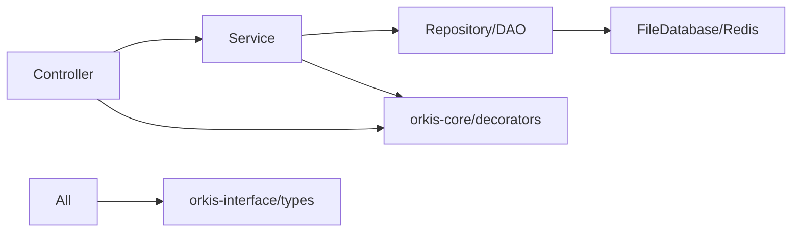

# ORKIS Backend 구조 개선 방안 v2.0

_orkis-core 프레임워크 및 orkis-interface를 고려한 전체 구조 분석 및 개선안_

## 목차

1. [현재 시스템 아키텍처 분석](#1-현재-시스템-아키텍처-분석)
2. [핵심 문제점 진단](#2-핵심-문제점-진단)
3. [개선 전략](#3-개선-전략)
4. [상세 실행 계획](#4-상세-실행-계획)
5. [위험 요소 및 완화 방안](#5-위험-요소-및-완화-방안)
6. [예상 효과](#6-예상-효과)

---

## 1. 현재 시스템 아키텍처 분석

### 1.1 기술 스택 구성

#### orkis-core 프레임워크 (DI Container)

```
@orkis/core (yalc 로컬 패키지)
├── decorators/       # @Controller, @Service, @Autowired 등
├── middleware/       # Express 미들웨어 지원
├── database/         # DB 연동 지원 (pg, sqlite3)
├── utils/            # logger 등 유틸리티
├── static/           # REQUEST_TYPE, FILTER_TYPES 등 상수
└── model/            # 기본 모델 정의
```

**특징:**

- Express 기반 DI(Dependency Injection) 컨테이너
- 데코레이터 기반 메타데이터 프로그래밍
- ApplicationContext를 통한 Bean 관리
- Component Scan을 통한 자동 Bean 등록
- Session 기반 인증 필터링 지원

#### orkis-interface 서브모듈 (공유 타입)

```
orkis-interface/ (Git Submodule)
├── src/
│   ├── ai/          # AI 서버 인터페이스
│   ├── backend/     # Backend API 타입
│   ├── core/        # 코어 프레임워크 타입
│   └── shared/      # 공통 타입 정의
```

**역할:**

- Frontend-Backend 간 타입 공유
- API 계약(Contract) 정의
- 서비스 간 통신 인터페이스

### 1.2 현재 Backend 구조 상세 분석

```
orkis-backend/
├── src/
│   ├── main/                    # 메인 애플리케이션 코드
│   │   ├── auth/                # 인증 모듈 (Handler Pattern 부분 적용)
│   │   │   ├── handlers/        # 로그인 핸들러들
│   │   │   │   ├── ILoginHandler.ts
│   │   │   │   ├── BaseLoginHandler.ts
│   │   │   │   ├── OAuthLoginHandler.ts
│   │   │   │   ├── PasswordLoginHandler.ts
│   │   │   │   └── [OAuth Providers]Handler.ts
│   │   │   ├── constants/       # 인증 관련 상수
│   │   │   ├── LoginController.ts (@Controller)
│   │   │   ├── LoginService.ts  (@Service)
│   │   │   └── LoginDao.ts      (@Component)
│   │   │
│   │   ├── chat/                # 채팅 모듈 (Clean Architecture 적용)
│   │   │   ├── controllers/     # 4개 컨트롤러로 분리
│   │   │   │   ├── ChatSessionController.ts
│   │   │   │   ├── ChatMessageController.ts
│   │   │   │   ├── ChatStreamController.ts
│   │   │   │   ├── ChatStreamEnhancedController.ts
│   │   │   │   └── ChatCompatController.ts
│   │   │   ├── services/        # 비즈니스 로직 분리
│   │   │   │   ├── ChatSessionService.ts
│   │   │   │   ├── ChatMessageService.ts
│   │   │   │   ├── ChatStreamService.ts
│   │   │   │   └── ChatStreamEnhancedService.ts
│   │   │   ├── repositories/    # 데이터 액세스 계층
│   │   │   │   ├── BaseRepository.ts
│   │   │   │   ├── ChatSessionRepository.ts
│   │   │   │   └── ChatMessageRepository.ts
│   │   │   ├── types/           # 채팅 관련 타입
│   │   │   ├── utils/           # 유틸리티 함수
│   │   │   ├── ChatDao.ts       # Legacy DAO (호환성)
│   │   │   └── ChatService.ts   # Legacy Service (호환성)
│   │   │
│   │   ├── menu/                # 메뉴 모듈 (혼재 상태)
│   │   │   ├── controllers/     # V2 컨트롤러
│   │   │   │   └── MenuController.v2.ts
│   │   │   ├── services/        # Clean Architecture 서비스
│   │   │   │   ├── MenuBusinessService.ts
│   │   │   │   ├── MenuValidationService.ts
│   │   │   │   └── MenuPermissionService.ts
│   │   │   ├── repositories/    # Repository Pattern
│   │   │   │   └── MenuRepository.ts
│   │   │   ├── types/           # 메뉴 타입 정의
│   │   │   ├── MenuController.ts # Legacy 컨트롤러
│   │   │   ├── MenuService.ts   # Legacy 서비스
│   │   │   └── MenuDao.ts       # Legacy DAO
│   │   │
│   │   ├── language-models/     # LLM 관리 (전통적 MVC)
│   │   │   ├── LanguageModelController.ts
│   │   │   ├── PublicLanguageModelController.ts
│   │   │   ├── LanguageModelService.ts
│   │   │   └── LanguageModelDao.ts
│   │   │
│   │   ├── database/            # DB 관리
│   │   │   ├── DatabaseManager.ts
│   │   │   └── PostgresConfig.ts
│   │   │
│   │   ├── service/             # 공통 서비스
│   │   │   └── fileDatabase.ts  # 파일 기반 DB
│   │   │
│   │   ├── redis/               # Redis 클라이언트
│   │   │   ├── redisClient.ts
│   │   │   └── messageRedisClient.ts
│   │   │
│   │   ├── middleware/          # Express 미들웨어
│   │   │   ├── CorsMiddleware.ts
│   │   │   ├── GlobalErrorHandler.ts
│   │   │   ├── OrkisInterCeptor.ts
│   │   │   └── ResponseHandler.ts
│   │   │
│   │   ├── config/              # 설정 파일
│   │   │   ├── AppConfig.ts
│   │   │   └── ErrorConfig.ts
│   │   │
│   │   ├── error/               # 에러 정의
│   │   │   ├── OrkisError.ts
│   │   │   └── ChatError.ts
│   │   │
│   │   ├── utils/               # 유틸리티
│   │   │   ├── tokenAuthHelper.ts
│   │   │   ├── stateManager.ts
│   │   │   ├── fsStorage.ts
│   │   │   └── ErrorResponse.ts
│   │   │
│   │   ├── health/              # 헬스 체크
│   │   ├── performance/        # 성능 모니터링
│   │   └── test/                # 테스트용 컨트롤러
│   │
│   ├── websocket/               # WebSocket 서버 (독립 운영)
│   │   ├── WebSocketServer.ts
│   │   ├── MessageHandler.ts
│   │   ├── SqlProcessManager.ts
│   │   ├── QuestionClassifier.ts
│   │   ├── auth.ts
│   │   └── types.ts
│   │
│   ├── types/                   # 호환성 타입
│   │   └── compatibility.ts    # Legacy 타입 유지
│   │
│   └── start.ts                 # 애플리케이션 진입점
│
├── db_file/                     # 파일 기반 데이터 저장소
│   ├── USER_INFO.json
│   ├── CHAT_SESSIONS.json
│   └── ...
│
├── db_schema/                   # DB 스키마 정의
├── resources/                   # 환경 설정 파일
│   ├── dev.env
│   ├── prod.env
│   └── docker.env
│
└── orkis-interface/            # Git Submodule
```

### 1.3 의존성 관계 분석

#### 프레임워크 의존성

```mermaid
graph TD
    A[orkis-backend] --> B[@orkis/core Framework]
    A --> C[orkis-interface Submodule]
    B --> D[Express.js]
    B --> E[IoC Container]
    B --> F[Decorators]
    C --> G[Shared Types]
    C --> H[API Contracts]
```

#### 모듈 간 의존성



## 2. 핵심 문제점 진단

### 2.1 구조적 일관성 부족

#### 문제 상황

- **혼재된 아키텍처 패턴**
  - Chat 모듈: Clean Architecture (완성도 높음)
  - Menu 모듈: Legacy와 V2 혼재
  - Auth 모듈: Handler Pattern (부분 적용)
  - Language Models: 전통적 MVC
  - 기타 모듈: 패턴 미적용

#### 영향

- 신규 개발자 온보딩 어려움
- 모듈 간 코드 재사용 어려움
- 유지보수 복잡도 증가

### 2.2 orkis-core 프레임워크 활용 미흡

#### 문제 상황

- **DI 기능 부분 활용**

  - @Autowired 사용 불일관
  - Bean 생명주기 관리 미흡
  - Component Scan 최적화 필요

- **프레임워크 기능 미활용**
  - database 모듈 미사용 (자체 구현)
  - middleware 표준화 미흡
  - 내장 유틸리티 활용도 낮음

#### 영향

- 프레임워크 이점 미실현
- 중복 코드 발생
- 표준화 부재

### 2.3 데이터 액세스 계층 문제

#### 문제 상황

- **파일 DB 직접 접근**

  ```typescript
  // 현재: 여러 곳에서 직접 파일 읽기/쓰기
  const data = JSON.parse(fs.readFileSync("db_file/USER_INFO.json"));
  ```

- **트랜잭션 관리 부재**

  - 파일 기반 DB의 동시성 문제
  - 데이터 일관성 보장 어려움

- **캐싱 전략 부재**
  - 매번 파일 I/O 발생
  - 성능 최적화 미흡

#### 영향

- 데이터 무결성 위험
- 성능 병목 현상
- 확장성 제한

### 2.4 타입 시스템 복잡도

#### 문제 상황

- **타입 정의 분산**

  - orkis-interface: 공유 타입
  - types/compatibility.ts: 호환성 타입
  - 각 모듈별 types 폴더: 내부 타입
  - orkis-core 타입: 프레임워크 타입

- **타입 중복 및 불일치**
  ```typescript
  // orkis-interface의 타입과
  // compatibility.ts의 타입이 다른 경우 존재
  ```

#### 영향

- 타입 안전성 저하
- 리팩토링 어려움
- IDE 지원 미흡

### 2.5 설정 관리 분산

#### 문제 상황

- **설정 소스 다중화**

  - 환경 변수 (dev.env, prod.env)
  - AppConfig.ts
  - 하드코딩된 상수
  - orkis-core 설정

- **검증 체계 부재**
  - 필수 환경 변수 체크 없음
  - 타입 안전성 없음

#### 영향

- 설정 오류 런타임 발견
- 환경별 관리 어려움
- 보안 위험

## 3. 개선 전략

### 3.1 기본 원칙

#### orkis-core 프레임워크 최대 활용

- 프레임워크가 제공하는 모든 기능 활용
- 표준 패턴 준수
- 커스터마이징 최소화

#### 점진적 마이그레이션

- 기존 기능 유지하며 새 구조 병행
- 모듈 단위 순차 적용
- API 버전 관리로 호환성 보장

#### 타입 우선 개발

- orkis-interface 중심 타입 정의
- 엄격한 타입 체크
- 런타임 타입 검증

### 3.2 목표 아키텍처

#### 계층 구조

```
Application Layer (Controllers + Middleware)
    ↓
Domain Layer (Services + Business Logic)
    ↓
Infrastructure Layer (Repository + External Services)
    ↓
Data Source Layer (FileDB, Redis, PostgreSQL)
```

#### 모듈 구조 표준화

```typescript
// 모든 모듈이 따라야 할 표준 구조
module/
├── controllers/      # @Controller 데코레이터 사용
├── services/         # @Service 데코레이터 사용
├── repositories/     # @Repository 데코레이터 사용
├── entities/         # 도메인 엔티티
├── dto/              # Data Transfer Objects
├── types/            # 모듈 내부 타입
└── index.ts          # 모듈 export
```

### 3.3 orkis-core 통합 전략

#### DI Container 표준화

```typescript
// 모든 클래스는 orkis-core DI 사용
@Controller("/api/v2/user")
export class UserController {
  @Autowired("UserService")
  private userService!: UserService;

  @Autowired("Logger")
  private logger!: Logger;

  @RequestMapping({
    route: "/profile",
    method: REQUEST_TYPE.GET,
    filteredType: FILTER_TYPES.CHECK_SESSION
  })
  async getUserProfile(@SessionParam() session: Session): Promise<ApiResponse> {
    return this.userService.getProfile(session.userId);
  }
}
```

#### 프레임워크 database 모듈 활용

```typescript
// orkis-core의 database 기능 사용
import { DatabaseAdapter } from "@orkis/core/database";

@Repository()
export class UserRepository extends DatabaseAdapter {
  constructor() {
    super("postgres"); // or "sqlite", "file"
  }

  async findById(id: string): Promise<User> {
    return this.query("SELECT * FROM users WHERE id = ?", [id]);
  }
}
```

## 4. 상세 실행 계획

### 4.1 Phase 0: 기반 구축 (1주)

#### 작업 내용

1. **표준 구조 정의**

   ```typescript
   // src/core/base/BaseController.ts
   export abstract class BaseController {
     protected handleSuccess<T>(data: T): ApiResponse<T> {
       return {
         success: true,
         data,
         timestamp: new Date().toISOString()
       };
     }

     protected handleError(error: Error): ApiResponse {
       return {
         success: false,
         error: {
           message: error.message,
           code: error.name
         },
         timestamp: new Date().toISOString()
       };
     }
   }
   ```

2. **공통 Repository 인터페이스**

   ```typescript
   // src/core/repository/IRepository.ts
   export interface IRepository<T> {
     findById(id: string): Promise<T | null>;
     findAll(filter?: FilterOptions): Promise<T[]>;
     create(entity: Partial<T>): Promise<T>;
     update(id: string, entity: Partial<T>): Promise<T>;
     delete(id: string): Promise<boolean>;
     exists(id: string): Promise<boolean>;
   }
   ```

3. **설정 관리 중앙화**

   ```typescript
   // src/core/config/ConfigurationManager.ts
   @Service()
   export class ConfigurationManager {
     private config: Map<string, any> = new Map();

     constructor() {
       this.loadFromEnv();
       this.validate();
     }

     @PostConstruct
     private validate(): void {
       const required = ["PORT", "RAG_SERVER_URL"];
       for (const key of required) {
         if (!this.get(key)) {
           throw new Error(`Missing config: ${key}`);
         }
       }
     }

     get<T>(key: string, defaultValue?: T): T {
       return this.config.get(key) ?? defaultValue;
     }
   }
   ```

### 4.2 Phase 1: Auth 모듈 표준화 (1주)

#### 현재 상태 분석

- Handler Pattern 부분 적용
- orkis-core DI 부분 사용
- 파일 DB 직접 접근

#### 개선 계획

```typescript
// 1. Repository 계층 추가
@Repository()
export class UserRepository implements IRepository<User> {
  @Autowired("FileDatabase")
  private fileDb!: FileDatabase;

  async findById(id: string): Promise<User | null> {
    const users = await this.fileDb.read<User>("USER_INFO");
    return users.find((u) => u.id === id) || null;
  }

  async findByUsername(username: string): Promise<User | null> {
    const users = await this.fileDb.read<User>("USER_INFO");
    return users.find((u) => u.username === username) || null;
  }
}

// 2. Service 계층 개선
@Service()
export class AuthService {
  @Autowired("UserRepository")
  private userRepository!: UserRepository;

  @Autowired("LoginHandlerFactory")
  private handlerFactory!: LoginHandlerFactory;

  async authenticate(
    type: LoginType,
    credentials: LoginCredentials
  ): Promise<AuthResult> {
    const handler = this.handlerFactory.getHandler(type);
    return handler.login(credentials);
  }
}

// 3. Controller 표준화
@Controller("/api/v2/auth")
export class AuthController extends BaseController {
  @Autowired("AuthService")
  private authService!: AuthService;

  @RequestMapping({
    route: "/login",
    method: REQUEST_TYPE.POST
  })
  async login(
    @RequestBody() request: LoginRequest
  ): Promise<ApiResponse<AuthResult>> {
    try {
      const result = await this.authService.authenticate(
        request.type,
        request.credentials
      );
      return this.handleSuccess(result);
    } catch (error) {
      return this.handleError(error);
    }
  }
}
```

### 4.3 Phase 2: Menu 모듈 통합 (1주)

#### 현재 상태

- Legacy와 V2 컨트롤러 혼재
- Repository Pattern 부분 적용
- Clean Architecture 부분 적용

#### 통합 전략

1. **Legacy Adapter Pattern**

   ```typescript
   @Service()
   export class MenuLegacyAdapter {
     @Autowired("MenuBusinessService")
     private menuService!: MenuBusinessService;

     // Legacy API 호환성 유지
     async getMenus(request: any): Promise<any> {
       const modern = await this.menuService.getUserMenus(request.userId);
       return this.toLegacyFormat(modern);
     }
   }
   ```

2. **단일 컨트롤러로 통합**

   ```typescript
   @Controller("/api/menu")
   export class MenuController extends BaseController {
     // V1 API (Legacy)
     @RequestMapping({ route: "/list" })
     async getMenusV1() {
       return this.legacyAdapter.getMenus();
     }

     // V2 API (Modern)
     @RequestMapping({ route: "/v2/user-menus" })
     async getUserMenus() {
       return this.menuService.getUserMenus();
     }
   }
   ```

### 4.4 Phase 3: 파일 DB 추상화 (2주)

#### 목표

- 파일 DB 접근 중앙화
- 트랜잭션 시뮬레이션
- 캐싱 레이어 추가
- 향후 DB 마이그레이션 준비

#### 구현 계획

```typescript
// 1. FileDatabase 개선
@Service()
export class FileDatabase {
  private cache: Map<string, any> = new Map();
  private locks: Map<string, boolean> = new Map();

  async transaction<T>(fn: () => Promise<T>): Promise<T> {
    const lockId = uuid();
    await this.acquireLock(lockId);
    try {
      const result = await fn();
      await this.commit();
      return result;
    } catch (error) {
      await this.rollback();
      throw error;
    } finally {
      this.releaseLock(lockId);
    }
  }

  @Cacheable({ ttl: 60000 })
  async read<T>(table: string): Promise<T[]> {
    if (this.cache.has(table)) {
      return this.cache.get(table);
    }
    const data = await this.readFromFile(table);
    this.cache.set(table, data);
    return data;
  }
}

// 2. Migration 준비
interface IMigrationAdapter {
  migrate(from: DataSource, to: DataSource): Promise<void>;
}

@Service()
export class FileToPostgresMigration implements IMigrationAdapter {
  async migrate(from: FileDatabase, to: PostgresDatabase): Promise<void> {
    // 점진적 마이그레이션 로직
  }
}
```

### 4.5 Phase 4: 타입 시스템 정리 (1주)

#### 타입 계층 구조 정립

```typescript
// 1. orkis-interface (공유 타입)
// orkis-interface/src/backend/entities.ts
export interface User {
  id: string;
  username: string;
  email: string;
}

// 2. Backend 내부 타입
// src/types/internal.ts
export interface UserWithPassword extends User {
  password: string; // Backend only
}

// 3. DTO 정의
// src/dto/auth.dto.ts
export class LoginRequestDto {
  @IsString()
  username: string;

  @IsString()
  password: string;
}
```

### 4.6 Phase 5: 테스트 인프라 구축 (2주)

#### 테스트 전략

```typescript
// 1. 단위 테스트
describe("AuthService", () => {
  let service: AuthService;
  let mockRepository: jest.Mocked<UserRepository>;

  beforeEach(() => {
    const module = Test.createTestingModule({
      providers: [
        AuthService,
        {
          provide: UserRepository,
          useValue: createMockRepository()
        }
      ]
    }).compile();

    service = module.get<AuthService>(AuthService);
  });

  it("should authenticate valid user", async () => {
    // Test implementation
  });
});

// 2. 통합 테스트
describe("Auth API Integration", () => {
  let app: INestApplication;

  beforeAll(async () => {
    app = await createTestApp();
  });

  it("POST /api/v2/auth/login", async () => {
    return request(app.getHttpServer())
      .post("/api/v2/auth/login")
      .send({ username: "test", password: "test" })
      .expect(200)
      .expect((res) => {
        expect(res.body.success).toBe(true);
      });
  });
});
```

## 5. 위험 요소 및 완화 방안

### 5.1 기술적 위험

#### orkis-core 프레임워크 제약

- **위험**: 프레임워크 한계로 인한 구현 제약
- **완화**:
  - 프레임워크 확장 포인트 활용
  - 필요시 PR을 통한 프레임워크 개선
  - Wrapper 패턴으로 추상화

#### 파일 DB 성능 한계

- **위험**: 대용량 데이터 처리 시 성능 저하
- **완화**:
  - 적극적인 캐싱 전략
  - 데이터 분할 저장
  - PostgreSQL 마이그레이션 준비

### 5.2 운영 위험

#### API 호환성 파괴

- **위험**: 기존 API 변경으로 Frontend 오류
- **완화**:
  - API 버전 관리 (v1, v2)
  - Deprecation 정책 (6개월 유예)
  - API 문서 자동화

#### 배포 중 서비스 중단

- **위험**: 구조 변경으로 인한 다운타임
- **완화**:
  - Blue-Green 배포
  - Feature Flag 활용
  - 롤백 시나리오 준비

### 5.3 조직적 위험

#### 개발팀 저항

- **위험**: 새로운 구조에 대한 학습 부담
- **완화**:
  - 단계적 도입
  - 충분한 문서화
  - 페어 프로그래밍

## 6. 예상 효과

### 6.1 단기 효과 (3개월)

#### 개발 효율성

- 코드 중복 30% 감소
- 버그 발생률 25% 감소
- 신규 기능 개발 시간 20% 단축

#### 시스템 안정성

- 에러 처리 표준화로 장애 대응 시간 50% 단축
- 타입 안전성 향상으로 런타임 에러 40% 감소

### 6.2 중장기 효과 (6개월~1년)

#### 확장성

- PostgreSQL 마이그레이션 준비 완료
- 마이크로서비스 전환 가능
- 수평 확장 지원

#### 유지보수성

- 온보딩 시간 50% 단축
- 코드 리뷰 시간 30% 감소
- 기술 부채 70% 해소

### 6.3 정량적 지표

| 지표          | 현재  | 목표 (6개월) | 측정 방법         |
| ------------- | ----- | ------------ | ----------------- |
| 코드 커버리지 | 0%    | 70%          | Jest Coverage     |
| API 응답 시간 | 200ms | 100ms        | APM 모니터링      |
| 배포 실패율   | 15%   | 5%           | CI/CD 통계        |
| 코드 중복도   | 25%   | 10%          | SonarQube         |
| 타입 커버리지 | 60%   | 95%          | TypeScript Strict |

## 부록

### A. 마이그레이션 체크리스트

#### Phase별 체크리스트

- [ ] Phase 0: 기반 구축

  - [ ] BaseController 구현
  - [ ] IRepository 인터페이스 정의
  - [ ] ConfigurationManager 구현
  - [ ] 테스트 환경 구축

- [ ] Phase 1: Auth 모듈

  - [ ] UserRepository 구현
  - [ ] AuthService 리팩토링
  - [ ] AuthController v2 구현
  - [ ] Legacy API 호환성 테스트

- [ ] Phase 2: Menu 모듈

  - [ ] Legacy Adapter 구현
  - [ ] 통합 Controller 구현
  - [ ] V1/V2 API 테스트

- [ ] Phase 3: 파일 DB

  - [ ] FileDatabase 개선
  - [ ] 캐싱 레이어 구현
  - [ ] 트랜잭션 시뮬레이션
  - [ ] 성능 테스트

- [ ] Phase 4: 타입 시스템

  - [ ] 타입 정의 통합
  - [ ] DTO 구현
  - [ ] 타입 검증 추가

- [ ] Phase 5: 테스트
  - [ ] 단위 테스트 작성
  - [ ] 통합 테스트 작성
  - [ ] E2E 테스트 구축
  - [ ] 커버리지 목표 달성

### B. 참고 자료

#### 아키텍처 패턴

- Clean Architecture (Robert C. Martin)
- Domain-Driven Design (Eric Evans)
- Dependency Injection Pattern
- Repository Pattern
- Adapter Pattern

#### 관련 문서

- `/doc/2025-08-07/orkis-backend-implementation-plan.md`
- `/doc/2025-08-07/CHAT_REFACTORING_PLAN.md`
- `/doc/2025-08-10/infinite-loading-resolution-analysis.md`
- `orkis-interface/CLAUDE.md`
- `orkis-core` 공식 문서

#### 기술 스택 문서

- [Express.js Best Practices](https://expressjs.com/en/advanced/best-practice-performance.html)
- [TypeScript Handbook](https://www.typescriptlang.org/docs/handbook/intro.html)
- [Jest Testing Framework](https://jestjs.io/docs/getting-started)
- [Node.js Design Patterns](https://www.nodejsdesignpatterns.com/)

### C. 용어 정의

| 용어               | 설명                                                   |
| ------------------ | ------------------------------------------------------ |
| orkis-core         | ORKIS 프로젝트의 핵심 DI 프레임워크                    |
| orkis-interface    | Frontend-Backend 간 공유 타입 정의 서브모듈            |
| Bean               | orkis-core에서 관리하는 의존성 주입 대상 객체          |
| Component Scan     | 데코레이터가 붙은 클래스를 자동으로 찾아 Bean으로 등록 |
| ApplicationContext | Bean들을 관리하는 IoC Container                        |
| FileDatabase       | 파일 기반 JSON 데이터베이스 시스템                     |
| Handler Pattern    | 로그인 타입별 처리를 분리한 패턴                       |
| Clean Architecture | 계층을 명확히 분리한 아키텍처 패턴                     |

---

_작성일: 2025-09-26_
_버전: 2.0_
_작성자: Claude_
_검토자: -_

이 문서는 orkis-core 프레임워크와 orkis-interface를 충분히 고려하여 작성되었으며, 실제 구현 시 지속적으로 업데이트되어야 합니다.
